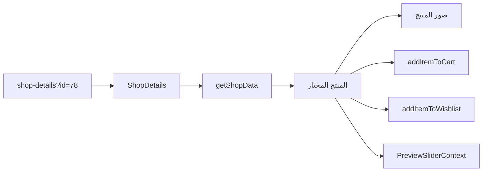
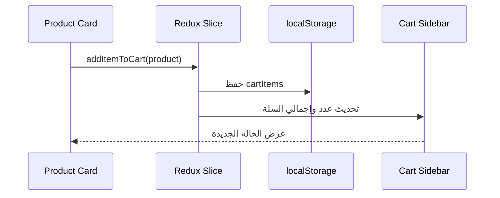

# خريطة مشروع Neora Tech Store

هذا الملف دليل مذاكرة للمشروع: أين يبدأ التطبيق، كيف تصل الصفحة إلى المكوّن، وكيف تنتقل البيانات من API أو Redux إلى الواجهة.

## 1. الصورة الكبيرة

المشروع متجر إلكتروني مبني بـ Next.js App Router:

- `src/app`: المسارات والـ layout العام.
- `src/components`: واجهة المستخدم ومكوّنات كل ميزة.
- `src/redux`: الحالة العامة للسلة والمفضلة والمنتج الحالي.
- `src/app/context`: حالات فتح وإغلاق النوافذ المنبثقة.
- `src/types`: عقود TypeScript للمنتجات والقوائم.
- `src/data`: بيانات ثابتة لبعض الأقسام.
- `public/images`: الصور والأيقونات المستخدمة في الواجهة.

```mermaid
flowchart TD
  Browser[المتصفح] --> Layout[src/app/(site)/layout.tsx]
  Layout --> Header[Header]
  Layout --> Providers[Redux و Context Providers]
  Layout --> Route[صفحة route المطلوبة]
  Route --> Feature[مكوّن الميزة]
  Feature --> API[getShopData / DummyJSON]
  Feature --> Redux[Redux slices]
  Feature --> Context[Modal contexts]
  Layout --> Modals[Quick View / Cart / Preview]
  Layout --> Footer[Footer]
```

## 2. أوامر التشغيل

من جذر المشروع:

```bash
npm install
npm run dev
npm run build
npm run start
npm run lint
```

- `npm run dev`: تشغيل بيئة التطوير.
- `npm run build`: اختبار build للإنتاج.
- `npm run start`: تشغيل نسخة build.
- `npm run lint`: فحص ESLint حسب إعداد Next.

الملفات التي تضبط المشروع:

- [`package.json`](package.json): الحزم والأوامر.
- [`next.config.js`](next.config.js): إعداد Next ومصادر الصور الخارجية.
- [`tsconfig.json`](tsconfig.json): TypeScript و alias `@/*` إلى `src/*`.
- [`tailwind.config.ts`](tailwind.config.ts): إعداد Tailwind و dark mode.
- [`postcss.config.js`](postcss.config.js): PostCSS و Tailwind.
- [`next-env.d.ts`](next-env.d.ts): أنواع Next التلقائية.
- [`README.md`](README.md): معلومات القالب الأصلية.

## 3. بداية تشغيل التطبيق

### [`src/app/(site)/layout.tsx`](src/app/(site)/layout.tsx)

هذا هو الغلاف المشترك لكل صفحات المتجر:

1. يستورد CSS العام والخط.
2. يعرض `PreLoader` لمدة قصيرة.
3. يركّب `ReduxProvider`.
4. يركّب `CartModalProvider` و`ModalProvider` و`PreviewSliderProvider`.
5. يعرض `Header`.
6. يعرض الصفحة الحالية في `{children}`.
7. يعرض النوافذ العامة: `QuickViewModal` و`CartSidebarModal` و`PreviewSliderModal`.
8. يعرض `ScrollToTop`.
9. يخفي `Footer` في `/signin` و`/signup`، ويعرضه في باقي الصفحات.

المجلد `(site)` و`(pages)` هما Route Groups، ولا يظهر اسمهما في الرابط النهائي.

### [`src/app/(site)/page.tsx`](src/app/(site)/page.tsx)

صفحة `/`، وتعرض مكوّن [`Home`](src/components/Home/index.tsx).

## 4. خريطة المسارات

| الرابط | ملف الصفحة | المكوّن الأساسي |
|---|---|---|
| `/` | `src/app/(site)/page.tsx` | `components/Home` |
| `/cart` | `src/app/(site)/(pages)/cart/page.tsx` | `components/Cart` |
| `/checkout` | `src/app/(site)/(pages)/checkout/page.tsx` | `components/Checkout` |
| `/contact` | `src/app/(site)/(pages)/contact/page.tsx` | `components/Contact` |
| `/error` | `src/app/(site)/(pages)/error/page.tsx` | `components/Error` |
| `/mail-success` | `src/app/(site)/(pages)/mail-success/page.tsx` | `components/MailSuccess` |
| `/my-account` | `src/app/(site)/(pages)/my-account/page.tsx` | `components/MyAccount` |
| `/shop-details?id=78` | `src/app/(site)/(pages)/shop-details/page.tsx` | `components/ShopDetails` |
| `/shop-with-sidebar` | `src/app/(site)/(pages)/shop-with-sidebar/page.tsx` | `components/ShopWithSidebar` |
| `/shop-without-sidebar` | `src/app/(site)/(pages)/shop-without-sidebar/page.tsx` | `components/ShopWithoutSidebar` |
| `/signin` | `src/app/(site)/(pages)/signin/page.tsx` | `components/Auth/Signin` |
| `/signup` | `src/app/(site)/(pages)/signup/page.tsx` | `components/Auth/Signup` |
| `/wishlist` | `src/app/(site)/(pages)/wishlist/page.tsx` | `components/Wishlist` |

كل ملف `page.tsx` يضبط metadata بسيطة ثم يستورد مكوّن الواجهة المقابل.

## 5. الـ Header والـ Footer

### `src/components/Header/`

- [`index.tsx`](src/components/Header/index.tsx): Header كامل، البحث، اختيار التصنيف، الثيم، الحساب، السلة، القائمة الرئيسية.
- [`menuData.ts`](src/components/Header/menuData.ts): بيانات روابط القائمة.
- [`Dropdown.tsx`](src/components/Header/Dropdown.tsx): رسم القوائم التي تحتوي `submenu`.
- [`CustomSelect.tsx`](src/components/Header/CustomSelect.tsx): اختيار التصنيف في البحث.
- [`../Common/Switch.tsx`](src/components/Common/Switch.tsx): مفتاح dark/light theme.

القائمة الحالية تحتوي على:

- `Home`.
- `Shop`.
- `Contact`.
- `Pages` وبداخلها `All Products` و`This Week's New Arrivals` و`This Month's Best Sellers`.

الثيم:

1. `Header` يقرأ `tech-store-theme` من `localStorage`.
2. يضيف أو يزيل class اسمها `dark` من عنصر `html`.
3. `Switch` يستقبل `checked` و`onChange`.
4. Tailwind وCSS يطبقان ألوان الوضع الداكن.

### [`src/components/Footer/index.tsx`](src/components/Footer/index.tsx)

Footer الموقع: روابط الحساب والمتجر والمساعدة ووسائل التواصل والنشرة البريدية. يتم إخفاؤه فقط في صفحات الدخول والتسجيل من الـ layout.

## 6. الصفحة الرئيسية

### [`src/components/Home/index.tsx`](src/components/Home/index.tsx)

ترتيب الصفحة الرئيسية:

1. `Hero`.
2. `Categories`.
3. `NewArrivals`.
4. `PromoBanner`.
5. `BestSeller`.
6. `Countdown`.
7. `Testimonials`.
8. `Newsletter`.

### `src/components/Home/Hero/`

- [`index.tsx`](src/components/Home/Hero/index.tsx): يجلب منتج هاتف وسماعة ويعرض بطاقات العروض، ويفتح `/shop-details?id=...`.
- `HeroShowcase.tsx`: المنتج الرئيسي في الـ Hero.
- `HeroCarousel.tsx`: عرض متحرك للمنتجات.
- `HeroFeature.tsx`: مزايا الشحن والدعم والإلغاء.

### `src/components/Home/Categories/`

- [`index.tsx`](src/components/Home/Categories/index.tsx): بطاقات التصنيفات وروابط التصفية.
- `CategoryItem.tsx`: بطاقة تصنيف واحدة.
- `categoriesData.ts`: بيانات التصنيفات.

### `src/components/Home/NewArrivals/`

- [`index.tsx`](src/components/Home/NewArrivals/index.tsx): يأخذ أحدث المنتجات من `getShopData` ويرسمها.
- `id="new-arrivals"`: نقطة وصول رابط القائمة.

### `src/components/Home/BestSeller/`

- [`index.tsx`](src/components/Home/BestSeller/index.tsx): يرتب المنتجات حسب `rating`.
- `id="best-sellers"`: نقطة وصول رابط القائمة.

### بقية أقسام Home

- `PromoBanner/index.tsx`: بانرات عروض، وتفاعل فتح المنتج.
- `Countdown/index.tsx`: عداد المنتج الخاص، يعتمد على `src/data/countdownProduct.ts`.
- `Testimonials/index.tsx`: آراء العملاء.
- `Testimonials/testimonialData.ts`: بيانات الآراء.
- `Newsletter` موجود في `src/components/Common/Newsletter.tsx`.

## 7. المنتجات والمتجر

### [`src/components/Shop/shopData.ts`](src/components/Shop/shopData.ts)

أهم مصدر منتجات في المشروع:

1. يطلب `https://dummyjson.com/products?limit=0`.
2. يفلتر التصنيفات المطلوبة.
3. يضيف منتج Havit المحلي إذا لم يكن موجودًا.
4. يعيد المنتجات والتصنيفات المشتقة.
5. يحتوي helpers مثل `getDiverseProducts` لتوزيع المنتجات في أقسام Home.

### `src/components/Shop/`

- `SingleGridItem.tsx`: بطاقة منتج في grid.
- `SingleListItem.tsx`: بطاقة منتج في list.
- `shopData.ts`: API والتحويلات والبيانات المشتركة.

بطاقة المنتج عادةً تستطيع:

- فتح Quick View.
- إضافة إلى السلة.
- إضافة إلى Wishlist.
- حفظ تفاصيل المنتج في Redux و`localStorage`.
- الانتقال إلى `/shop-details?id=...`.

### `ShopWithSidebar/`

صفحة متجر بها sidebar وفلاتر:

- `index.tsx`: إدارة المنتجات والفلاتر والعرض.
- `CategoryDropdown.tsx`: اختيار التصنيف.
- `GenderDropdown.tsx`: فلتر النوع.
- `SizeDropdown.tsx`: فلتر المقاس.
- `ColorDropdown.tsx`: فلتر اللون.
- `PriceDropdown.tsx`: فلتر السعر.
- `PriceDropdownWithSlider.tsx`: slider للسعر.
- `RangeProgress.tsx`: شريط مدى السعر.
- `SortDropdown.tsx`: ترتيب النتائج.
- `SingleGridItem.tsx` و`SingleListItem.tsx`: عناصر العرض.

### `ShopWithoutSidebar/`

- `index.tsx`: متجر بدون sidebar.
- يدعم query parameters للبحث والتصنيف.
- يبدل بين grid/list ويستخدم نفس بطاقات `Shop`.

### `ShopDetails/`

- [`index.tsx`](src/components/ShopDetails/index.tsx): تحميل المنتج من `?id=`, معرض الصور، السعر، الخيارات، السلة، Wishlist.
- `ProductDetails.tsx`: تفاصيل المنتج إن وُجد ضمن النسخة الحالية.
- `RecentlyViewd/`: مجلد كان خاصًا بقسم Browse by Category وتمت إزالته من العرض.

تدفق صفحة التفاصيل:



## 8. السلة والشراء

### `src/components/Cart/`

- `index.tsx`: صفحة السلة.
- `SingleItem.tsx`: عنصر سلة واحد.
- `Discount.tsx`: كوبون الخصم.
- `OrderSummary.tsx`: الإجماليات والانتقال للدفع.

### `src/components/Common/CartSidebarModal/`

- `index.tsx`: drawer السلة الجانبي.
- `SingleItem.tsx`: عنصر داخل drawer.
- `EmptyCart.tsx`: حالة السلة الفارغة.

### `src/components/Checkout/`

- `index.tsx`: ترتيب شاشة checkout.
- `Login.tsx`: صندوق تسجيل الدخول داخل checkout.
- `Shipping.tsx`: بيانات الشحن.
- `ShippingMethod.tsx`: طريقة الشحن.
- `Billing.tsx`: بيانات الفاتورة.
- `Coupon.tsx`: الكوبون.
- `Notes.tsx`: ملاحظات الطلب.
- `PaymentMethod.tsx`: الدفع.
- `OrderList.tsx`: ملخص المنتجات.

## 9. Redux والحالة العامة

### [`src/redux/store.ts`](src/redux/store.ts)

ينشئ store ويصدر hooks مثل `useAppSelector` و`useAppDispatch`، بالإضافة إلى selectors مشتركة.

### [`src/redux/provider.tsx`](src/redux/provider.tsx)

يركب Redux `Provider`، ويقرأ `cartItems` و`wishlistItems` من `localStorage`، ثم يحفظ التغييرات.

### `src/redux/features/`

- [`cart-slice.ts`](src/redux/features/cart-slice.ts): إضافة وحذف وتعديل كمية ومسح السلة و`selectTotalPrice`.
- [`wishlist-slice.ts`](src/redux/features/wishlist-slice.ts): إضافة وحذف ومسح المفضلة.
- [`product-details.ts`](src/redux/features/product-details.ts): المنتج الحالي لصفحة التفاصيل.
- [`quickView-slice.ts`](src/redux/features/quickView-slice.ts): المنتج الحالي للـ Quick View.

تدفق شراء منتج:



## 10. Contexts والنوافذ المنبثقة

موجودة في `src/app/context/`:

- `CartSidebarModalContext.tsx`: `openCartModal` و`closeCartModal` وحالة drawer.
- `QuickViewModalContext.tsx`: فتح وإغلاق Quick View والمنتج المحدد.
- `PreviewSliderContext.tsx`: فتح معرض الصور وتحديد الصورة الحالية.

المكوّنات المرتبطة في `src/components/Common/`:

- `CartSidebarModal/index.tsx`.
- `QuickViewModal.tsx`.
- `PreviewSlider.tsx`.

## 11. المصادقة والحساب والطلبات

### `Auth/`

- `Auth/Signin/index.tsx`: واجهة Sign In.
- `Auth/Signup/index.tsx`: واجهة Sign Up.
- النماذج الحالية presentational؛ لا يوجد backend أو session حقيقي مربوط بـ `next-auth`.
- روابط التحويل بين Sign In وSign Up موجودة.

### `MyAccount/`

- `index.tsx`: صفحة الحساب وتبويباتها.
- `tabsData.tsx`: بيانات التبويبات.
- `AddressModal.tsx`: إضافة/تعديل العنوان.
- الطلبات المعروضة Mock وليست متصلة بقاعدة بيانات.

### `Orders/`

- `index.tsx`: قائمة الطلبات.
- `ordersData.tsx`: بيانات الطلبات الثابتة.
- `SingleOrder.tsx`: صف طلب.
- `OrderDetails.tsx`: تفاصيل الطلب.
- `OrderActions.tsx`: إجراءات الطلب.
- `OrderModal.tsx`: نافذة الطلب.
- `EditOrder.tsx`: تعديل الطلب.

## 12. المكونات المشتركة

- `Breadcrumb.tsx`: عنوان ومسار الصفحة.
- `Newsletter.tsx`: الاشتراك في النشرة.
- `PreLoader.tsx`: شاشة التحميل الأولى.
- `ProductItem.tsx`: بطاقة منتج مشتركة في بعض الأقسام.
- `QuickViewModal.tsx`: المعاينة السريعة.
- `PreviewSlider.tsx`: معرض الصور المنبثق.
- `ScrollToTop.tsx`: زر الرجوع لأعلى الصفحة.
- `Switch.tsx`: تبديل light/dark.

## 13. الأنواع والبيانات الثابتة

### `src/types/`

- `product.ts`: نوع المنتج، الصور، المراجعات، الخصم، الشحن، helpers للأسعار والمراجعات.
- `Menu.ts`: شكل عنصر القائمة و`submenu`.
- `category.ts`: شكل التصنيف.
- `testimonial.ts`: شكل رأي العميل.

### `src/data/`

- `countdownProduct.ts`: منتج العداد وبياناته الاحتياطية.

### `src/hooks/`

المجلد موجود حاليًا لكنه لا يحتوي hooks مخصصة فعالة.

## 14. CSS والخطوط

- [`src/app/css/style.css`](src/app/css/style.css): القواعد العامة وclasses المخصصة.
- `async-gallery.css`: تنسيقات معرض الصور.
- `euclid-circular-a-font.css`: تعريف خط Euclid.
- `src/fonts/`: ملفات الخط.
- `tailwind.config.ts`: ألوان ومسافات وخطوط وdark mode.

## 15. الصور والأصول

كل الصور العامة تبدأ من `/images/...` وتوجد داخل `public/images/`:

- `hero/`: صور الـ Hero.
- `categories/`: صور التصنيفات.
- `arrivals/`: صور العروض الجديدة.
- `products/`: صور منتجات محلية.
- `promo/`: بانرات العروض.
- `countdown/`: صور العداد.
- `quickview/`: صور المعاينة.
- `sellers/`: صور أفضل المنتجات.
- `cart/`: صور السلة.
- `checkout/`: أيقونات شركات الشحن والدفع.
- `payment/`: وسائل الدفع.
- `icons/`: أيقونات عامة.
- `users/`: صور العملاء.
- `shapes/`: خلفية النشرة.
- `logo/` و`404.svg`: الشعار وصفحة الخطأ.

## 16. أجزاء غير مكتملة أو Mock

هذه نقاط مهمة أثناء المذاكرة:

- Sign In وSign Up واجهات فقط؛ لا يوجد تسجيل فعلي.
- Checkout لا يرسل طلبًا إلى backend.
- Orders وMy Account يعتمدان على بيانات ثابتة.
- لا يوجد `src/app/api` حاليًا.
- `next-auth`, `next-sanity`, `sanity`, و`nodemailer` موجودة في dependencies لكن لا يوجد تدفق فعال واضح لها في `src`.
- بيانات المنتجات الأساسية تأتي من DummyJSON عبر الإنترنت.
- توجد أصول blog قديمة في `public/images/blog/`، لكن routes ومكونات blog أزيلت من `src`.

## 17. خطة مذاكرة مقترحة

1. ابدأ بـ `src/app/(site)/layout.tsx` وافهم تركيب الصفحة العام.
2. اقرأ `Header/index.tsx` و`menuData.ts` لفهم التنقل والثيم.
3. اقرأ `Home/index.tsx` ثم قسمًا واحدًا مثل `NewArrivals`.
4. اقرأ `Shop/shopData.ts` لأنه مصدر المنتجات المشترك.
5. افهم `Product.ts` ثم `SingleGridItem.tsx`.
6. انتقل إلى `cart-slice.ts` و`wishlist-slice.ts`.
7. اتبع رحلة المنتج: Card -> Redux -> Cart/Quick View -> ShopDetails.
8. اقرأ `CartSidebarModalContext` و`QuickViewModalContext`.
9. اختم بـ Checkout وMyAccount وOrders لفهم الشاشات الأقل اتصالًا بالـ backend.

أفضل تمرين: أضف console log مؤقتًا في `getShopData`, `addItemToCart`, و`openQuickView`، ثم نفّذ رحلة منتج كاملة من Home إلى Cart.
